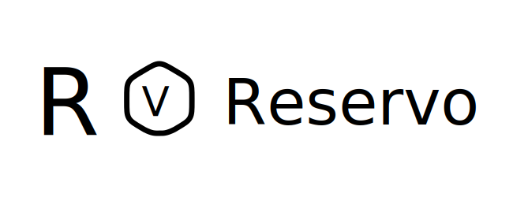
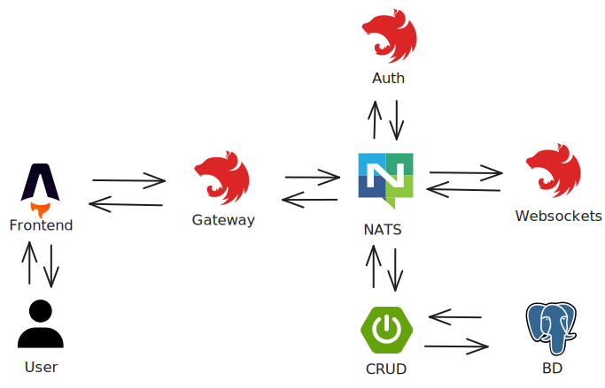

    

# Table of Contents

- [Table of Contents](#table-of-contents)
- [Reservo Background and Purpose](#reservo-background-and-purpose)
- [Reservo WebSocket MS](#reservo-websocket-ms-)
- [Environment Setup](#environment-setup-)
  - [Prerequisites](#prerequisites)
  - [Project Initialization](#project-initialization)
- [Licence](#licence)

# Reservo Background and Purpose

Reservo began as a personal project with **the goal of learning and experimenting firsthand with microservices architecture**, understanding both its strengths and challenges while building a solution to manage auditorium reservations.

I also wanted to explore a technology outside the JavaScript ecosystem for building web servers, so I chose Java 17 with Spring Boot as the project's core. This journey allowed me to acquire new knowledge, reinforce best practices, and build a repository designed to offer a clean and maintainable development experience.

I recognize that the distribution of responsibilities among the microservices could have been simplified. However, I wanted to challenge myself by simulating a more complex environment, where orchestrating multiple services simultaneously was necessary. While this made the process more demanding, it also gave me a deeper understanding of what it means to work with this type of architecture at a larger scale.

Reservo is composed of five repositories:

- [Frontend built with Astro and React 🚀](https://github.com/Hector-f-Romero/reservo-front)
- [NestJS API Gateway responsible for routing requests to the appropriate microservice 🧠](https://github.com/Hector-f-Romero/reservo-api-gateway)
- [Spring Boot microservice that handles CRUD operations for core entities 🎨](https://github.com/Hector-f-Romero/reservo-events-user-ms)
- [Hybrid NestJS app that uses WebSockets and communicates across services ⌚](https://github.com/Hector-f-Romero/reservo-ws-ms)
- [NestJS microservice dedicated to authentication 🔐](https://github.com/Hector-f-Romero/reservo-auth-ms)

    

Each repository includes documentation on the main challenges faced and lessons learned throughout development. Looking back, I feel proud of the effort invested and the outcome achieved with this project.

# Reservo WebSocket MS ⌚

This microservice is part of a distributed event-driven architecture for real-time reservation management in Reservo. Thanks to NestJS's support for hybrid application design, it enables both direct communication with web clients via WebSockets and coordination between microservices through NATS.

As a result, users can access a room using the event ID and see in real time which seats are available and which are being reserved — all thanks to updates sent by the events microservice whenever a seat's status changes.

# Environment Setup ⚙

## Prerequisites
- Node 22.12.0
- Docker Desktop
- pnpm 10.8.0

## Project Initialization

1. Clone this repository and navigate to the project directory.
2. Install dependencies using the package manager: `pnpm install`.
3. Create the environment variables file with: `cp .env.example .env`.
4. Fill in the required values in the `.env` file.
5. Run the Gateway server with: `pnpm run start:dev`.
6. Make sure the following services are running:
   - Reservo Auth MS
   - Reservo Events User MS
   - Reservo WebSocket MS.
7. Send an `HTTP POST` request to the `/V1/seed` endpoint to populate the database with test data.
8. Verify that the frontend successfully connects to this server via WebSockets when navigating to an event page.

# Licence

See the `LICENSE` file for more information.